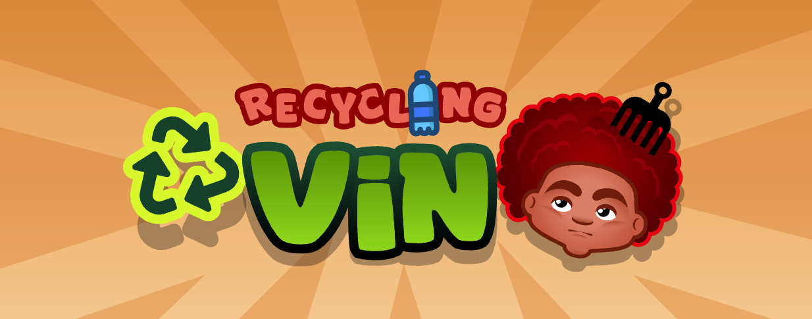

# Recycling Vin

### (Global Gamers Challenge Submission)

Recycling Vin is an action-packed mobile game that transforms players into eco-friendly warriors alongside the spirited kid-hero, Vin. Armed with a green thumb and a passion for sustainability, Vin takes on the nefarious 'frackingsteins,' monstrous foes threatening the environment with their pollution. Join Vin in a thrilling adventure as you battle these villains, solve eco-friendly puzzles, and make impactful choices to save the planet. With each victory, players learn about the importance of recycling, renewable energy, and conservation, turning Recycling Vin into not just a game, but a fun-filled journey towards a greener, more sustainable future!

